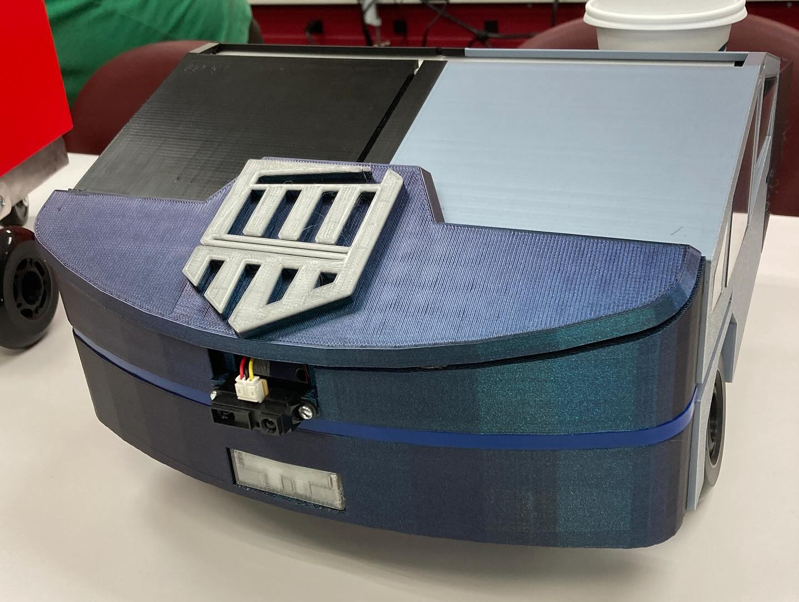

Robotics:
========

This repository contains the code, documentation, and resources for multiple robotics projects

## Digital Clock Circuit with 7-Segment Display

This schematic illustrates a microcontroller-based digital clock circuit. The system features:

Microcontroller: ATmega328P, the heart of the design, controls timekeeping and display logic.

Display Interface: Two sets of 74LS138N decoders and 74LS47 BCD-to-7-segment drivers are used to control four 7-segment displays (two for hours, two for minutes).

User Input: Momentary pushbuttons (SW1–SW4) allow for manual time setting (e.g., hours, minutes, mode selection).

Power Supply: AC to DC conversion is handled by a bridge rectifier (D1), followed by voltage regulation using a 7805 regulator to supply +5V DC.

Timing Circuit: A 16 MHz crystal oscillator ensures accurate timekeeping for the ATmega328P.

Additional Features:

Capacitor bank for power stabilization

ISP header for in-circuit programming

PMOS/NPN pair for switching logic or additional outputs

Dual LED indicators and protection diodes

## PCC MIT-101
This project aims to create an advanced robotics platform that integrates various sensors, AI APIs for object identification, and autonomous navigation capabilities to deliver small cargo efficiently.

This repo contains the produced solid works file and the arduino code use during the PCC semester, new changes will be published here.

